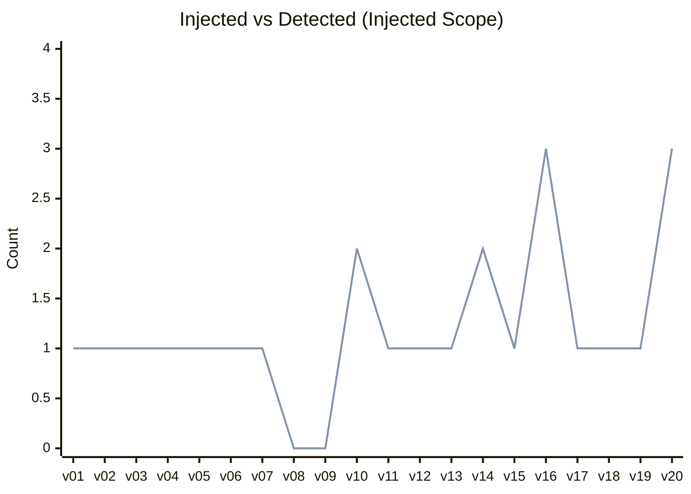
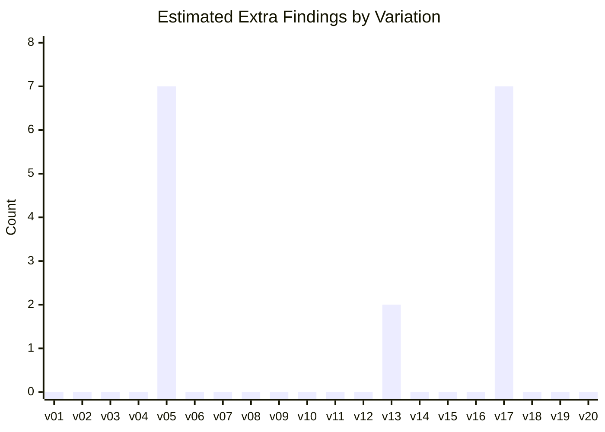
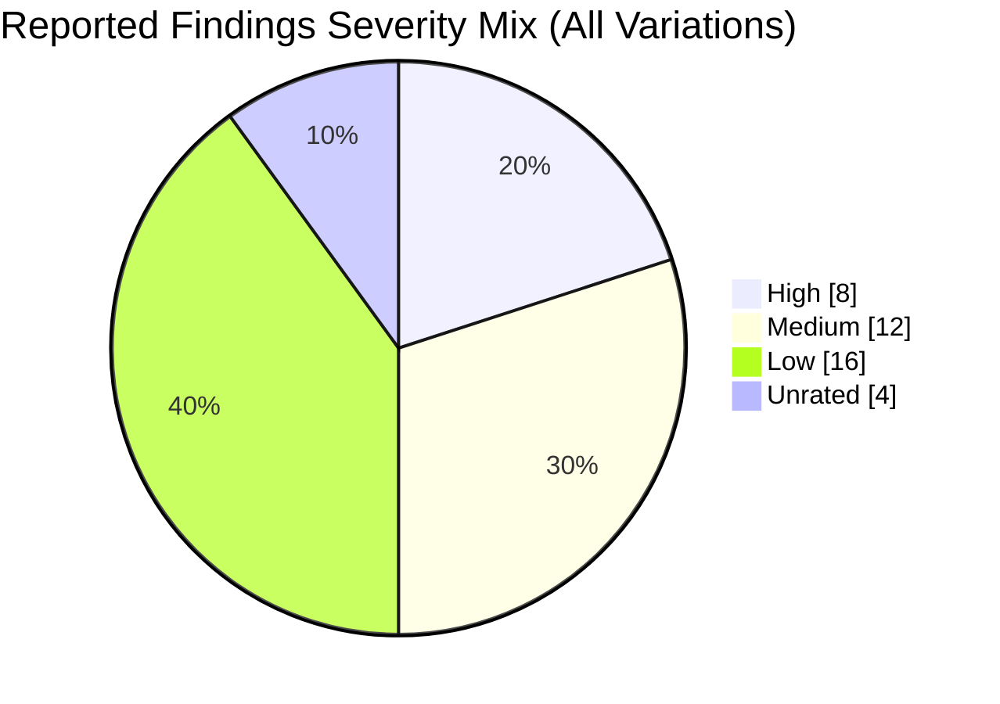

# New Run Quality Report

This report is generated exclusively from the latest completed run artifacts in `tests/`.

## Run Scope

- Generated at: 2026-06-18T21:49:12
- Primary aggregate source: [tests/ANALYSIS.json](tests/ANALYSIS.json)
- Per-variation sources: [tests/todo-01/cli-review/cli-review.md](tests/todo-01/cli-review/cli-review.md) through [tests/todo-20/cli-review/cli-review.md](tests/todo-20/cli-review/cli-review.md)

## Executive Summary

- Variations: 20
- Injected violations: 24
- Average injected-detection coverage: 100.0%
- Estimated extra findings (reported minus injected): 16

## Visualization: Injected vs Detected (Per Variation)

## Visualization: Estimated Extra Findings

## Visualization: Reported Findings Severity Mix

## Per-Variation Details

| Variation | Injected | Detected (Injected Scope) | Coverage | Reported Total | Extra | Details |
|---|---:|---:|---:|---:|---:|---|
| todo-01 | 1 | 1 | 100.0% | 1 | 0 | [report](tests/todo-01/cli-review/cli-review.md) · [metadata](tests/todo-01/violation_metadata.json) · [session](tests/todo-01/session.json) · [session meta](tests/todo-01/session_meta.json) |
| todo-02 | 1 | 1 | 100.0% | 1 | 0 | [report](tests/todo-02/cli-review/cli-review.md) · [metadata](tests/todo-02/violation_metadata.json) · [session](tests/todo-02/session.json) · [session meta](tests/todo-02/session_meta.json) |
| todo-03 | 1 | 1 | 100.0% | 1 | 0 | [report](tests/todo-03/cli-review/cli-review.md) · [metadata](tests/todo-03/violation_metadata.json) · [session](tests/todo-03/session.json) · [session meta](tests/todo-03/session_meta.json) |
| todo-04 | 1 | 1 | 100.0% | 1 | 0 | [report](tests/todo-04/cli-review/cli-review.md) · [metadata](tests/todo-04/violation_metadata.json) · [session](tests/todo-04/session.json) · [session meta](tests/todo-04/session_meta.json) |
| todo-05 | 1 | 1 | 100.0% | 8 | 7 | [report](tests/todo-05/cli-review/cli-review.md) · [metadata](tests/todo-05/violation_metadata.json) · [session](tests/todo-05/session.json) · [session meta](tests/todo-05/session_meta.json) |
| todo-06 | 1 | 1 | 100.0% | 1 | 0 | [report](tests/todo-06/cli-review/cli-review.md) · [metadata](tests/todo-06/violation_metadata.json) · [session](tests/todo-06/session.json) · [session meta](tests/todo-06/session_meta.json) |
| todo-07 | 1 | 1 | 100.0% | 1 | 0 | [report](tests/todo-07/cli-review/cli-review.md) · [metadata](tests/todo-07/violation_metadata.json) · [session](tests/todo-07/session.json) · [session meta](tests/todo-07/session_meta.json) |
| todo-08 | 0 | 0 | 100.0% | 0 | 0 | [report](tests/todo-08/cli-review/cli-review.md) · [metadata](tests/todo-08/violation_metadata.json) · [session](tests/todo-08/session.json) · [session meta](tests/todo-08/session_meta.json) |
| todo-09 | 0 | 0 | 100.0% | 0 | 0 | [report](tests/todo-09/cli-review/cli-review.md) · [metadata](tests/todo-09/violation_metadata.json) · [session](tests/todo-09/session.json) · [session meta](tests/todo-09/session_meta.json) |
| todo-10 | 2 | 2 | 100.0% | 2 | 0 | [report](tests/todo-10/cli-review/cli-review.md) · [metadata](tests/todo-10/violation_metadata.json) · [session](tests/todo-10/session.json) · [session meta](tests/todo-10/session_meta.json) |
| todo-11 | 1 | 1 | 100.0% | 1 | 0 | [report](tests/todo-11/cli-review/cli-review.md) · [metadata](tests/todo-11/violation_metadata.json) · [session](tests/todo-11/session.json) · [session meta](tests/todo-11/session_meta.json) |
| todo-12 | 1 | 1 | 100.0% | 1 | 0 | [report](tests/todo-12/cli-review/cli-review.md) · [metadata](tests/todo-12/violation_metadata.json) · [session](tests/todo-12/session.json) · [session meta](tests/todo-12/session_meta.json) |
| todo-13 | 1 | 1 | 100.0% | 3 | 2 | [report](tests/todo-13/cli-review/cli-review.md) · [metadata](tests/todo-13/violation_metadata.json) · [session](tests/todo-13/session.json) · [session meta](tests/todo-13/session_meta.json) |
| todo-14 | 2 | 2 | 100.0% | 2 | 0 | [report](tests/todo-14/cli-review/cli-review.md) · [metadata](tests/todo-14/violation_metadata.json) · [session](tests/todo-14/session.json) · [session meta](tests/todo-14/session_meta.json) |
| todo-15 | 1 | 1 | 100.0% | 1 | 0 | [report](tests/todo-15/cli-review/cli-review.md) · [metadata](tests/todo-15/violation_metadata.json) · [session](tests/todo-15/session.json) · [session meta](tests/todo-15/session_meta.json) |
| todo-16 | 3 | 3 | 100.0% | 3 | 0 | [report](tests/todo-16/cli-review/cli-review.md) · [metadata](tests/todo-16/violation_metadata.json) · [session](tests/todo-16/session.json) · [session meta](tests/todo-16/session_meta.json) |
| todo-17 | 1 | 1 | 100.0% | 8 | 7 | [report](tests/todo-17/cli-review/cli-review.md) · [metadata](tests/todo-17/violation_metadata.json) · [session](tests/todo-17/session.json) · [session meta](tests/todo-17/session_meta.json) |
| todo-18 | 1 | 1 | 100.0% | 1 | 0 | [report](tests/todo-18/cli-review/cli-review.md) · [metadata](tests/todo-18/violation_metadata.json) · [session](tests/todo-18/session.json) · [session meta](tests/todo-18/session_meta.json) |
| todo-19 | 1 | 1 | 100.0% | 1 | 0 | [report](tests/todo-19/cli-review/cli-review.md) · [metadata](tests/todo-19/violation_metadata.json) · [session](tests/todo-19/session.json) · [session meta](tests/todo-19/session_meta.json) |
| todo-20 | 3 | 3 | 100.0% | 3 | 0 | [report](tests/todo-20/cli-review/cli-review.md) · [metadata](tests/todo-20/violation_metadata.json) · [session](tests/todo-20/session.json) · [session meta](tests/todo-20/session_meta.json) |

## Notes

- `Detected (Injected Scope)` and coverage come from [tests/ANALYSIS.json](tests/ANALYSIS.json).
- `Reported Total` and `Extra` are derived from severity counts in each variation report markdown.
- `Extra` is an estimate: `max(0, Reported Total - Injected)` and is useful as a precision signal.