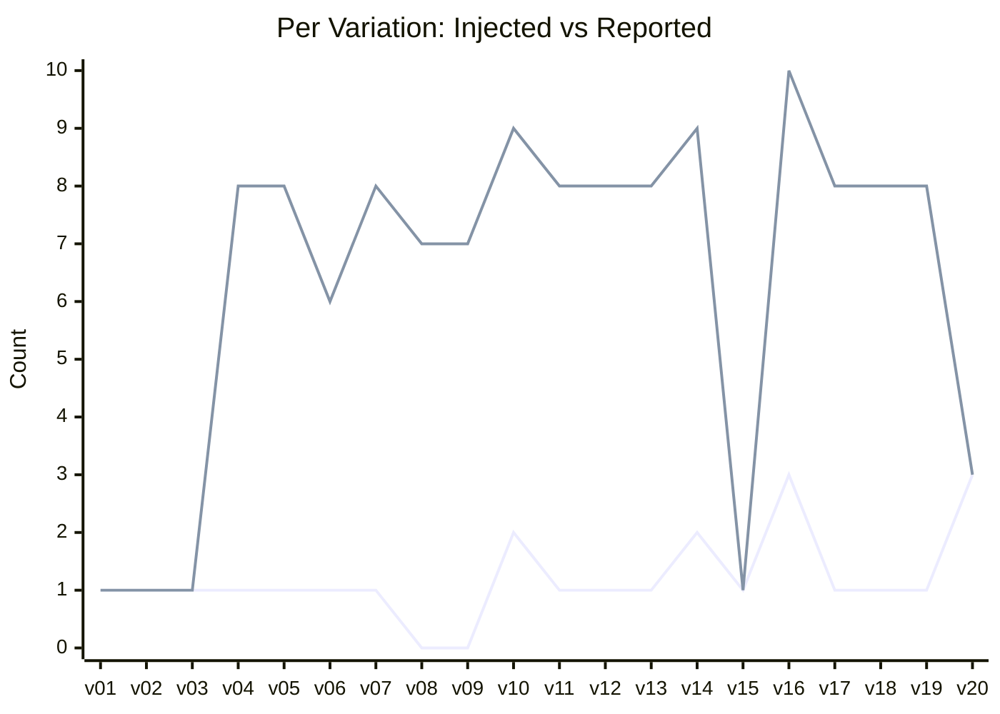

# Visual Summary

Data source: [tests/rule_detection_summary.json](tests/rule_detection_summary.json)

## Coverage By Severity (Injected Rule Match)

```mermaid
xychart-beta
    title "Injected Rule Coverage by Severity"
    x-axis [HIGH, MEDIUM, LOW]
    y-axis "Count" 0 --> 10
    bar [8, 8, 8]
    bar [8, 8, 8]
```

Legend: first bar = injected, second bar = detected.

## Variation-Level Signal (Injected vs Reported Findings)

## Quick Tables

| Severity | Injected | Detected | Coverage |
|---|---:|---:|---:|
| HIGH | 8 | 8 | 100.0% |
| MEDIUM | 8 | 8 | 100.0% |
| LOW | 8 | 8 | 100.0% |